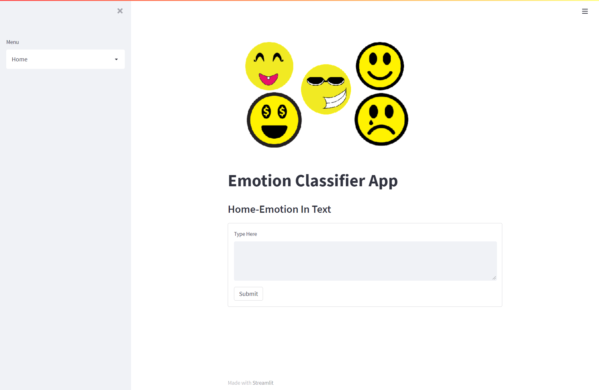
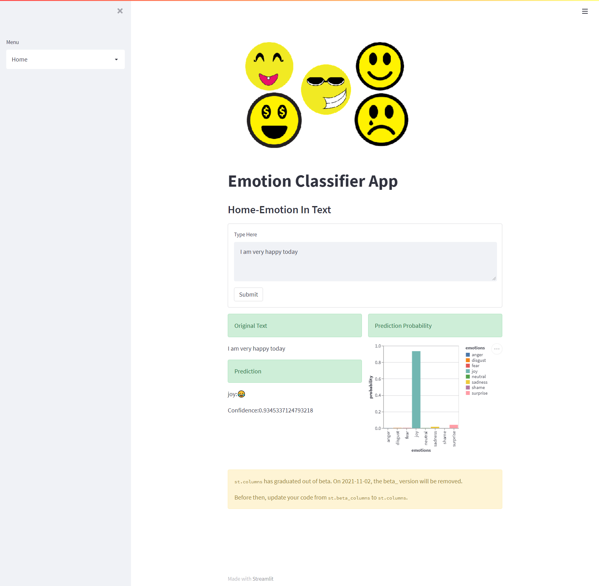
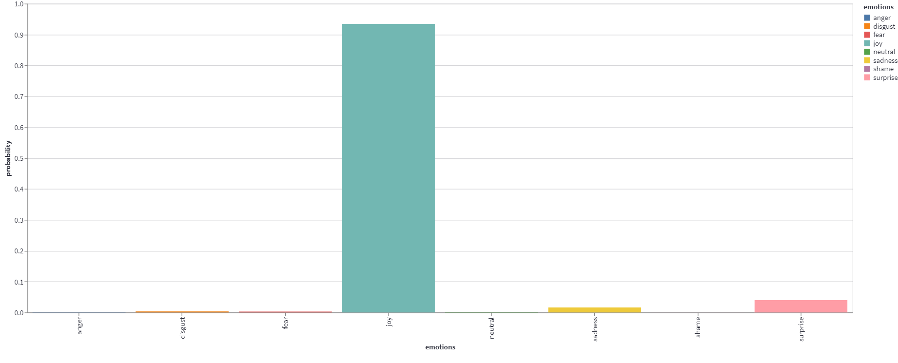

# Mood Detector 😄 😞 😨 😮

Multi-class sentiment analysis problem to classify texts into eight emotion categories: joy, sadness, anger, fear, neutral, disgust, shame, surprise 

## Deployment Link: https://mood123.herokuapp.com/
The deployment is done on Heroku with the help of Streamlit

## Description
Mood detection is a technique used in software that allows a program to predict the emotions of a person by understanding the context of the texts provided bythe same. Companies have been experimenting with combining sophisticated algorithms that have emerged in the past ten years to understand more about the extent of replicating the emotions of a person by just texts or language spoken.

## Here's the Preview:

## Prediction Preview: 

## Prediction Probability Graph :

## Steps followed

- Text Dataset Collection
- Labelling dataset for the class they belong to
- Loading dataset in jupyter
- Cleaning the dataset using NeatText
- Creation of train and test data
- Creating a pipeline
- Using CountVectorizer 
- Using Logistic Regression for Multiple CLasses
- Prediction then chhecking the accuracy
- Saving the model
- Loading the model in pycharm
- Creating an api to run on local system
- Deploying the model

## Technology used
- Python
- Pandas
- Tensorflow/Keras
- NeatText
- Sklearn
- Joblib
- Pycharm
- Streamlit
- Heroku

### Thank You! 😃
